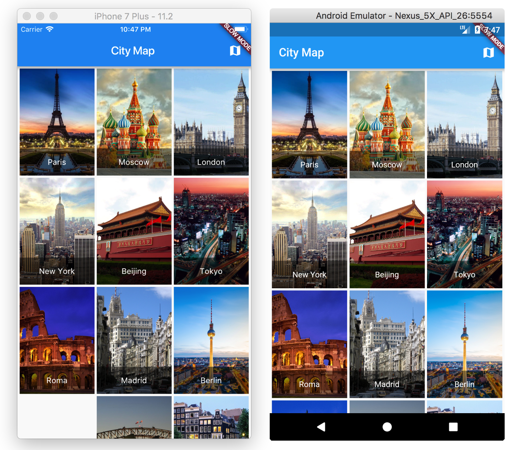

# City Map - Android & iOS application (Dart)

## Flutter
Implemented on [Flutter](https://flutter.io/).
For help getting started with Flutter, view online [documentation](https://flutter.io/).

## Details

**City Map** - simple mobile application for show information about some cities.

Based on [IT Shark Community](https://github.com/it-shark-pro) idea.

### Key features:
- navigation;
- load data from the network;
- offline;
- map.

## Other implementations:
- [City Map - iOS - Swift](https://github.com/it-shark-pro/mobile-citymap-ios)
- [City Map - Android - Java](https://github.com/it-shark-pro/mobile-citymap-android)
- [City Map - Universal Windows Platform - C#](https://github.com/it-shark-pro/mobile-citymap-uwp)
- [City Map - iOS & Android - C# & Xamarin](https://github.com/it-shark-pro/mobile-citymap-xamarin)

If you have any questions, ideas or improvements, welcome to the [issues](https://github.com/wcoder/itsharkpro-citymap-flutter/issues/new) or [PR](https://github.com/wcoder/itsharkpro-citymap-flutter/pulls).

---
&copy; 2018 Yauheni Pakala | MIT
